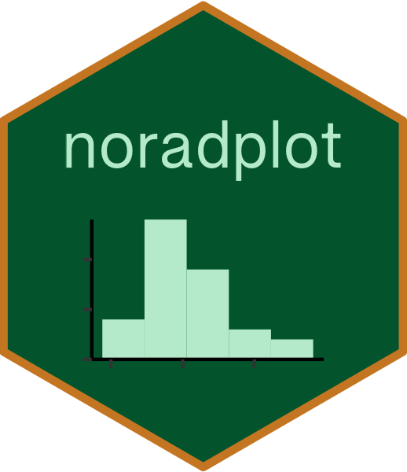
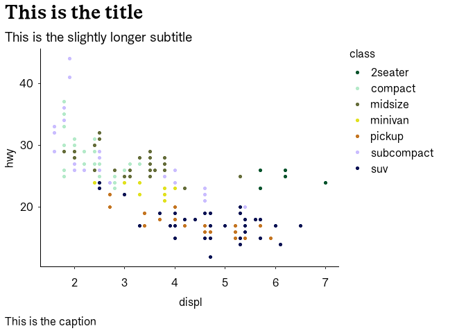

<!-- README.md is generated from README.Rmd. Please edit that file -->

# noradplot 

## Overview

Norads colour palette and plot style for creating ggplot2 graphics.

## Example

``` r

library(ggplot2)
library(noradplot)
ggplot(mpg, aes(displ, hwy, color = class)) + 
  geom_point() +
  theme_norad() +
  scale_color_norad()
```

<!-- -->

Credits: Based on Simon Jackson’s blog post: Creating corporate colour
palettes for ggplot2, BBC BBC Visual and Data Journalism cookbook for R
graphics: <https://bbc.github.io/rcookbook/> and Meghan Halls blog post
Creating Custom colour palettes for ggplot2:
<https://meghan.rbind.io/blog/2022-10-11-creating-custom-color-palettes-with-ggplot2/>
