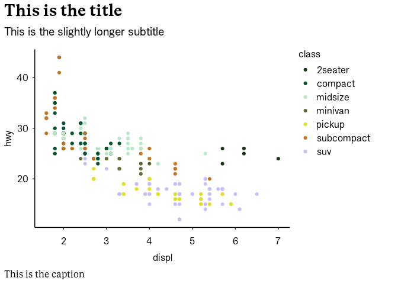
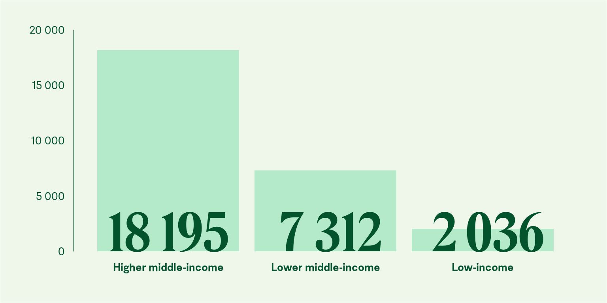
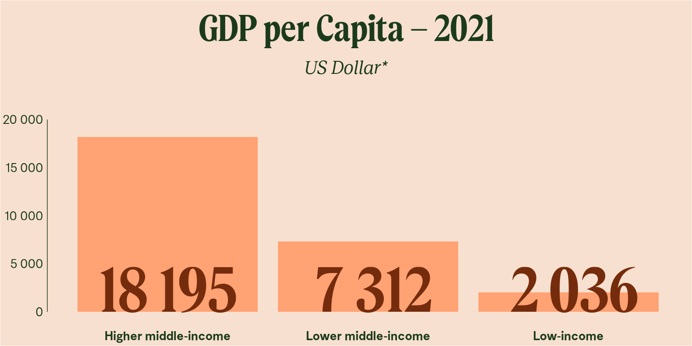
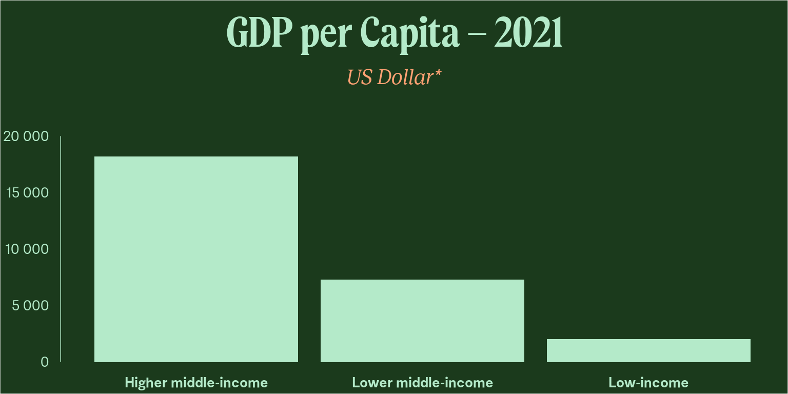

<!-- README.md is generated from README.Rmd. Please edit that file -->

# noradplot 

## Overview

Norads colour palette and plot style for creating ggplot2 graphics.

- Use `ggnorad()` to add Norad plot style

- Use `scale_*` functions to add norad colour palette

## Examples

### Default theme, suitable for reports

``` r
library(ggplot2)
library(noradplot)

ggnorad()

ggplot(mpg, aes(displ, hwy, color = class)) + 
  geom_point() +
  scale_color_norad() +
  labs(title = "This is the title",
       subtitle = "This is the slightly longer subtitle",
       caption = "This is the caption")
```

<!-- -->

### Colorful theme, suitable for presentations

``` r
ggnorad(style = "biglight1")

gdppc <- data.frame(gdppc = c(18195, 7312, 2036),
                    incomegroup = c("Higher middle-income", "Lower middle-income", "Low-income"))

ggplot(gdppc, aes(reorder(incomegroup, -gdppc), gdppc)) + 
  geom_col(width = 0.9, fill = norad_cols("lightgreen")) +
  scale_y_continuous(expand = expansion(c(0, 0.1)), labels = scales::label_comma(big.mark = " ")) +
  geom_text(aes(x = incomegroup, y = 2300, label = paste0(format(round(gdppc, 1), big.mark = " "))),
            size = 36, family = "Norad Display", color = norad_cols("darkgreen")) +
  labs(title = "GDP per Capita – 2021", x = NULL, y = NULL,
       subtitle = "US Dollar*") +
  coord_cartesian(clip = "off") +
  theme(axis.line.x = element_blank(), axis.text.x = element_text(face = "bold"))
```

<!-- -->

``` r
ggnorad(style = "biglight2")

ggplot(gdppc, aes(reorder(incomegroup, -gdppc), gdppc)) + 
  geom_col(width = 0.9, fill = norad_cols("orange")) +
  scale_y_continuous(expand = expansion(c(0, 0.1)), labels = scales::label_comma(big.mark = " ")) +
  geom_text(aes(x = incomegroup, y = 2300, label = paste0(format(round(gdppc, 1), big.mark = " "))),
            size = 36, family = "Norad Display", color = norad_cols("brown")) +
  labs(title = "GDP per Capita – 2021", x = NULL, y = NULL,
       subtitle = "US Dollar*") +
  coord_cartesian(clip = "off") +
  theme(axis.line.x = element_blank(), axis.text.x = element_text(face = "bold"))
```

<!-- -->

``` r
ggnorad(style = "bigdark")
#> Warning in ggnorad(style = "bigdark"): This style is high contrast. Use
#> additional visual elements with care.

ggplot(gdppc, aes(reorder(incomegroup, -gdppc), gdppc)) + 
  geom_col(width = 0.9, fill = norad_cols("lightgreen")) +
  scale_y_continuous(expand = expansion(c(0, 0.1)), labels = scales::label_comma(big.mark = " ")) +
  labs(title = "GDP per Capita – 2021", x = NULL, y = NULL,
       subtitle = "US Dollar*") +
  coord_cartesian(clip = "off") +
  theme(axis.line.x = element_blank(), axis.text.x = element_text(face = "bold"))
```

<!-- -->

## Credits

Based on Simon Jackson’s blog post: Creating corporate colour palettes
for ggplot2, BBC BBC Visual and Data Journalism cookbook for R graphics:
<https://bbc.github.io/rcookbook/> and Meghan Halls blog post Creating
Custom colour palettes for ggplot2:
<https://meghan.rbind.io/blog/2022-10-11-creating-custom-color-palettes-with-ggplot2/>
